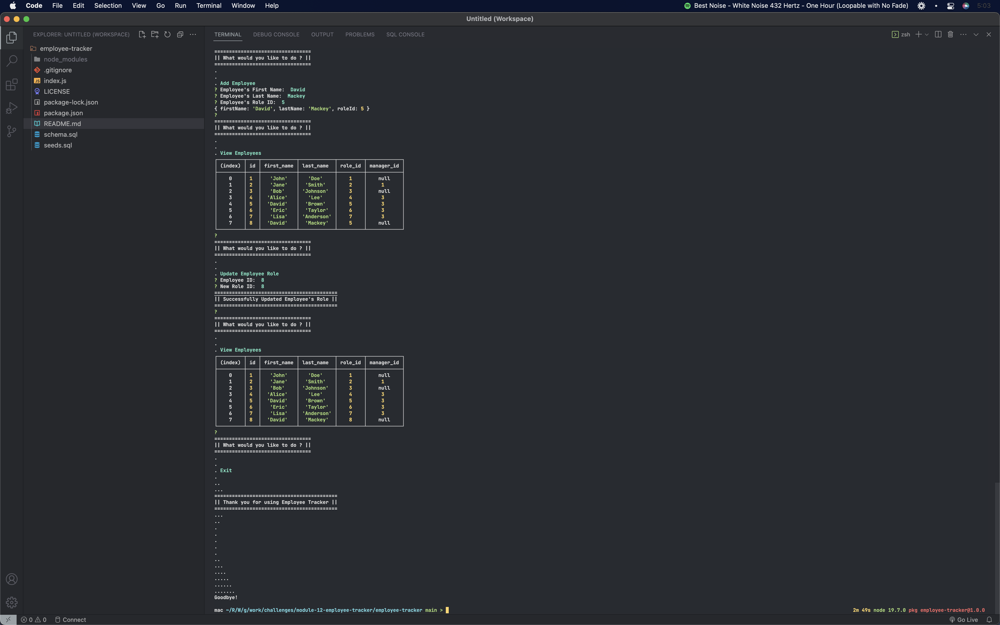

# { Employee Tracker }
📊
## Badges

## Table of Contents

- [Links](#links)
- [Description](#description)
- [Installation](#installation)
- [Usage](#usage)
- [Credits](#credits)
- [License](#license)
- [Contribute](#contribute)
- [Questions](#questions)

## Links
[Employee Tracker Demonstration Video](https://www.loom.com/share/2f40c4cae091453d9b69f571e390bd79)

## Description
This is a command-line application from scratch to manage a company's employee database AKA Content Management System (CMS), using Node.js, Inquirer, and MySQL2.

## Installation
Follow these commands to run the command-line application:  

    mysql -u root -p
    input your password
    source schema.sql
    source seeds.sql
    npm i
    npm start

## Usage

  

## Credits

:bust_in_silhouette: [David Michael Mackey](https://www.notion.so/davidmichaelmackey/David-Mackey-a59ce61a996840d6a933e3b135673467?pvs=4) 
:email: [Email](mailto:davidmackey@hey.com) 
:octocat: [GitHub](https://github.com/davidmichaelmackey/) 
:briefcase: [Linkedin](https://linkedin.com/in/davidmichaelmackey/) 

### Resources

  [MySQL Shell](https://dev.mysql.com/doc/mysql-shell/8.0/en/mysql-shell-getting-started.html)
  [Creating Database](https://dev.mysql.com/doc/refman/8.0/en/creating-database.html)
  [Creating Tables](https://dev.mysql.com/doc/refman/8.0/en/creating-tables.html)
  [SELECT](https://dev.mysql.com/doc/refman/8.0/en/select.html)
  [INSERT](https://dev.mysql.com/doc/refman/8.0/en/insert.html)
  [UPDATE](https://dev.mysql.com/doc/refman/8.0/en/update.html)
  [DELETE](https://dev.mysql.com/doc/refman/8.0/en/delete.html)
  [MySQL2 NPM Package](https://www.npmjs.com/package/mysql2)
  [Data Types](https://dev.mysql.com/doc/refman/8.0/en/data-types.html)
  [Schema](https://docs.oracle.com/cd/B19306_01/server.102/b14220/schema.htm)
  [Loading Tables](https://dev.mysql.com/doc/refman/8.0/en/loading-tables.html)
  [Primary Key](https://dev.mysql.com/doc/refman/8.0/en/constraint-primary-key.html)
  [Foreign Keys](https://dev.mysql.com/doc/refman/8.0/en/create-table-foreign-keys.html)
  [SQL Prepared Statements](https://dev.mysql.com/doc/refman/8.0/en/sql-prepared-statements.html)
  [Aggregate Functions](https://dev.mysql.com/doc/refman/8.0/en/aggregate-functions.html)
  [Join](https://dev.mysql.com/doc/refman/8.0/en/join.html)

## Toolset

      
      
      
      
      
      
      
      

## License

  

## Contribute

[Contributor Covenant](https://www.contributor-covenant.org/)

## Questions

Have Questions?
 
Feel free send me an [email](mailto:davidmackey@hey.com) or reach out to me on [Linkedin](https://linkedin.com/in/davidmichaelmackey/).

